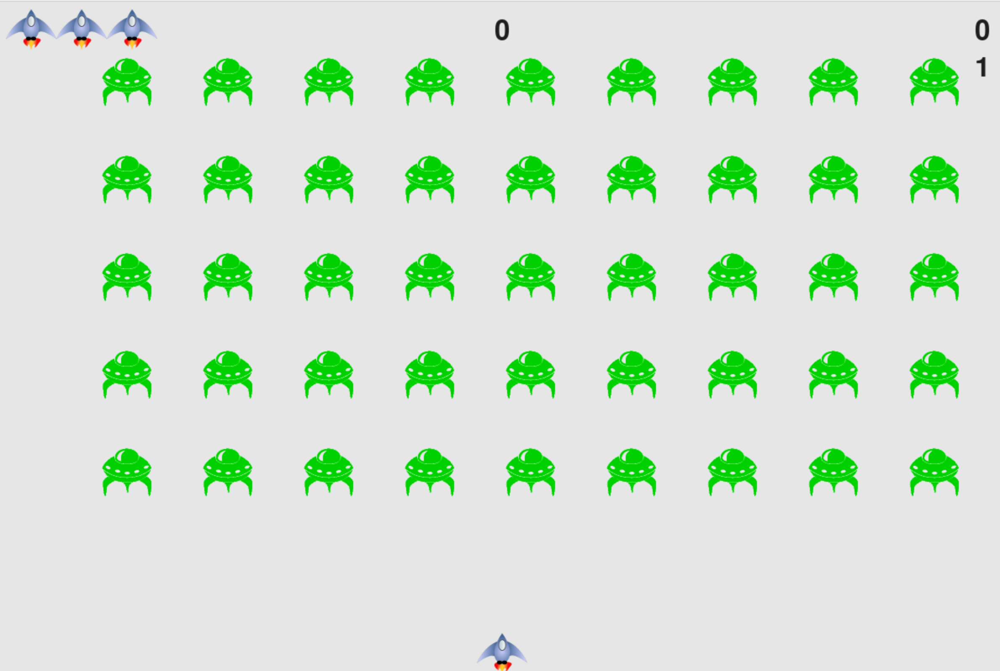

<div align="center">
  <h1>🚀 Alien Invasion</h1>
  <p>A classic 2D space shooter game built with Python and Pygame.</p>

  [中文](docs/README.md) | [English](README.md)
  
  <br />
  <br />
  
  
</div>

---

## ✨ Features
- **Player-Controlled Spaceship**: Navigate through space and defend against invaders.
- **Dynamic Alien Fleet**: Enemies move continuously and drop down, increasing the challenge.
- **Score & Leveling System**: Track your highest score and advance through levels with increasing difficulty.
- **Start/Replay Mechanism**: Easy-to-use play button to start new games.

## 🛠️ Requirements
- Python 3.x
- Pygame (2.6.1 or later)

## 📦 Installation

1. **Clone the repository**:
   ```bash
   git clone git@github.com:hulk-2019/alien-invasion.git
   cd alien-invasion
   ```

2. **Install the dependencies**:
   ```bash
   pip install -r requirements.txt
   ```

## 🎮 How to Play

Run the main script to launch the game:
```bash
python main.py
```

### Controls
| Key | Action |
| --- | --- |
| `⬅️ Left Arrow` | Move ship to the left |
| `➡️ Right Arrow` | Move ship to the right |
| `Spacebar` | Shoot bullets |
| `Q` | Quit the game |
| `Mouse Click` | Click the **Play** button to start |

## 📄 License
This project is licensed under the MIT License.
